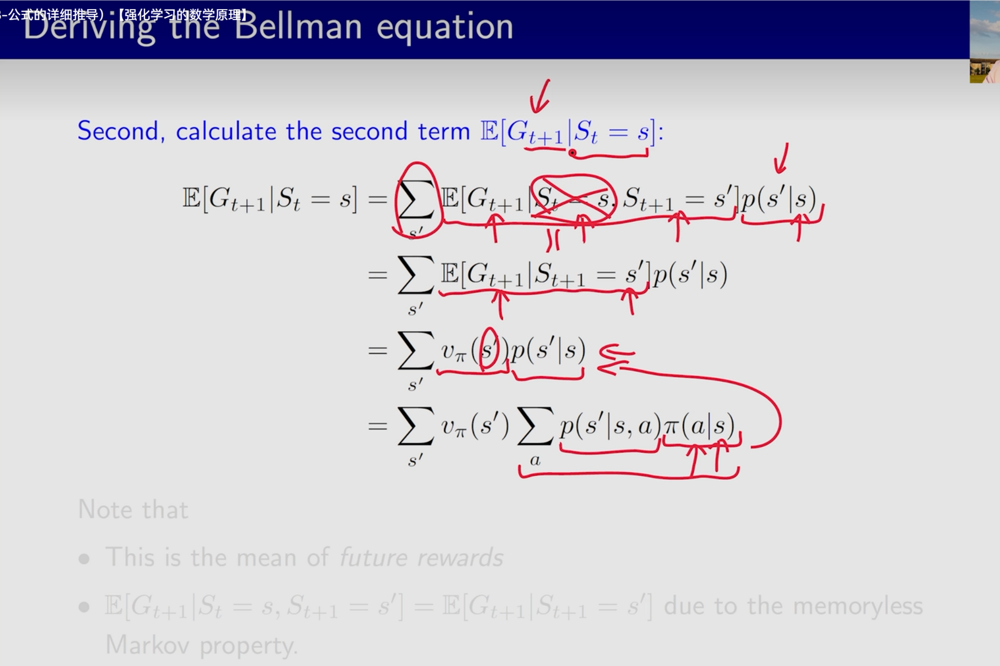

# Learning records about Embodied-AI
## 1. Useful Info - 有利于搭建认知的资料

+ 简单涉及场景理解、数据引导、动作执行的工作流程
将llm定位为大脑，灵巧操作定义为小脑，目前大、小脑发展不均衡

## 2.Common Tools - 常用工具
+ 点云配准：即将两个及以上来源不同、坐标系不一致的点云数据，通过数据方法变换到统一坐标系下，在空间中尽可能对齐。

### 2.1 点云降采样

+ Random Sample：随机选取一些点保留，在仅需降采样查看大致形状、不需配准时使用。
+ Uniform Sample：均匀降采样，等间隔地选点，借助体素方格。体素即小正方体，每个体素里选一个点。可以选择体心（一般不选），可选离体心最近点，或随机选点代表体素。

+ Farthest Point Sample：先随机选一个点，再加入离这个点最远的点，再加入离已选点的集合距离最远的点。。。（PointNet++即使用）。可以尽可能照顾到all points，but slow，计算量大。

+ Normal Space Sample: 法向量降采样，尽可能使得各个点的法线法向方向均匀。
+ 去噪：这种方法可以分别归纳为去噪，滤波，降采样，都有一定合理之处）。在搜索时候有R-NN相应的有R-NN方式的降采样——遍历所有点，当某个点R半径内的点少于一定数量时，去除该点。这个方法较难控制的一点是阈值K的选择；另外一种是Statistical Outlier Removal，基于统计的角度进行降采样（剔除噪声）。对每个点，我们计算它到它的所有临近点的平均距离。假设得到的结果是一个高斯分布，其形状由均值和标准差决定，平均距离在标准范围（由全局距离平均值和方差定义）之外的点，可被定义为离群点并可从数据集中去除掉。
+ 深度学习降采样：通过语义分析而非几何分析来实现降采样，准确率自然高。推测loss用生成点和原来点的集合差距，目的是约束降采样后的点和生成的点。

### 2.2 手眼标定
+ 手眼标定：用于确认机械臂和相机之间/相机和相机之间的相对位置，project开始前一般都需要做一次手眼标定，分眼在手上/眼在手外两种。
+ [fishros/handeye-calib](https://github.com/fishros/handeye-calib): 基于ROS的手眼标定
基础使用是在得到多组机械臂位姿与机械臂末端相机位姿之后直接使用本程序进行计算机械臂末端与相机之间的位姿关系。

## 3.Robot Learning - 机器人学习
### 3.1 Proportional–Integral–Derivative control(PID)
+ 控制量
                    
### 3.2 Model Predictive Control(MPC)                   
+ 有限时间内平稳优化，允许error，滚动优化
    + 滚动优化：目标有预测目标+控制目标（约束能量小，更平缓地接近target）。
    + 误差补偿：其实就是真实值+误差值修正，预测未来p个步长时误差值只使用最后一个非预测步的误差值（后面的预测步在到达后滚动迭代）。

### 3.3 Reinforcement Learning - 强化学习

+ RL的数学原理 - 西湖大学赵世钰：[bilibili](https://space.bilibili.com/2044042934/channel/collectiondetail?sid=748665) [GitHub](https://github.com/MathFoundationRL/Book-Mathematical-Foundation-of-Reinforcement-Learning)

#### Chapter 2: Bellman Equation

+  Bellman equation是已知策略求state value。看似v1-v4的state value都需要其它的状态，但可以通过bootstrapping的计算技巧求解，左边为matrix-vector form.
+ state value, action value,元素形式的bellman equation
虽然大部分情况有close-form的解（当矩阵不可逆时无close-form solution），但是矩阵计算耗时，多采用iterative method.

+ Bellman equation的推导中，可以将第二项（未来的return）化为已知的概率。马尔可夫特性：memoryless。

#### Chapter 3: Bellman Optimality Equation

+ 策略未知，同时求state value和最优策略的一个优化过程。
这个方程需要从右边开始看，s.t.等式右侧$max$的策略$\pi_{argmax}$，那么此时$v^*$也取到$max$，即$v_{\pi}$。
+ Elementwise form && Matrix-vector form

#### Chapter 4: Value Iteration & Policy Iteration
+ 两种iteration,policy方式是一次PE一次PI，直到最优policy; value方式先迭代policy,再一次更新value。

#### Chapter 5: Monte Carlo Learning
+ 使用大量采样数据，采好所有样本后估计。

#### Chapter 6: Stochastic Approximation
+ MBGD,BGD,SGD的比较
    + BGD使用一个样本里所有的数据来减小目标函数，MBGD随机使用其中的m个样本来减少，SGD则是随机一个样本。

+ Mean estimation问题可以借助RM方式迭代近似解。
    + SGD算法是一种特殊的RM算法。这几种方式都是随机梯度下降/随机近似。

这里比较绕，虽然最优策略已知，但我们需要通过拟合的vhat函数求vΠ（St），所以true用一个replace方式来做，在数学上实际是优化另外一个objective function的过程。             

#### Chapter 7: Tmporal-Difference Learning
+ 最经典的TD算法形式是利用采样/experience近似,以增量的方式迭代求解state value。目标是让当前st状态下的state value估计最优策略下的state value。

+ Sarsa指的是采样的五条数据（$S_t$,$A_t$,$R_{t+1}$,$S_{t+1}$,$A_{t+1}$），作为一个step，通过采样来迭代近似，估计最优策略下的action value。
+ 这一过程可以和policy update结合，每一个step后取出让action value最大的action,更新策略，给予这个action一个更大的概率。

+ n-step Sarsa对于discounted return的定义形式介于MC和Sarsa之间。

+ 从一个统一视角看，can be expressed in a unified expression
Q target有着不同的形式。

#### Chapter 8: Value Function Approximation

+ 研究动机是对于很多state，如果都将对应的state value以tabular形式存，消耗空间，类比曲线拟合方式，希望找到一个近似的拟合函数，可以对应一个s求$v_{s}$。

+ 这里比较绕，虽然最优策略已知，但我们需要通过拟合的$vhat$函数求$v_{\pi}(S_t)$，所以true value function用一个replace方式来做，在数学上实际是优化另外一个objective function的过程。             

#### Chapter 9: Policy Gradient Methods

+ policy base,看作一个策略$\pi$的函数$f(\pi)$,$\theta$是整个函数的参数，常常以下面的神经网络方式表示。$S$经过网络$\theta$的一次向前传播，输出动作的概率（策略$\pi$）。

+ 对于Metrics的两种定义

+ 后续不展开，是一个类似的求导过程，梯度上升$s.t$ $J(\theta)->Maximum$